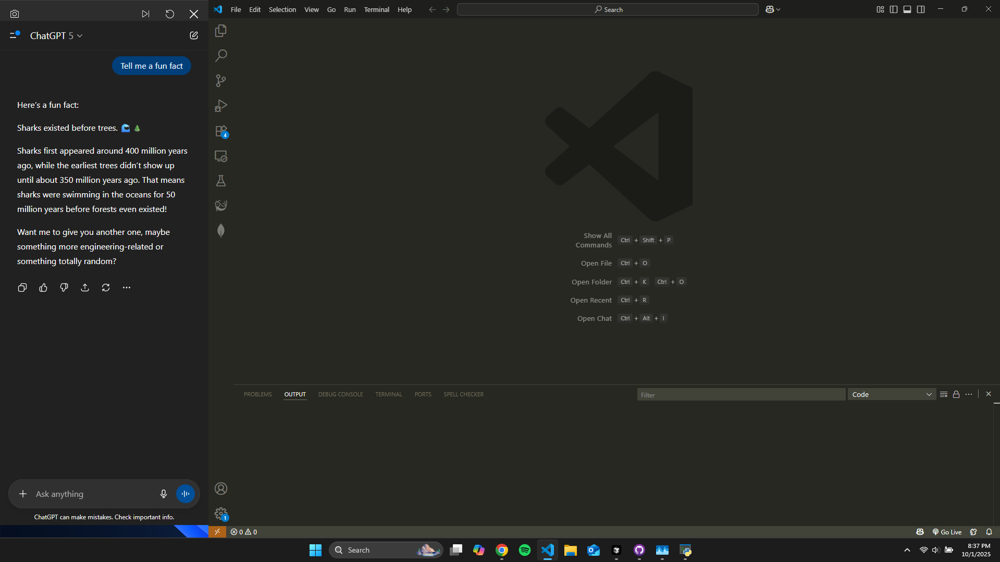
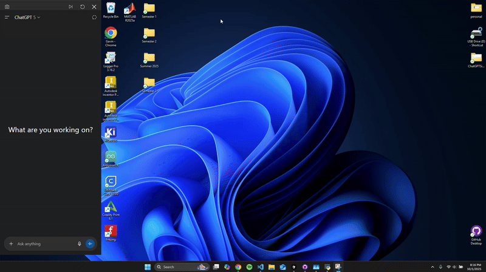
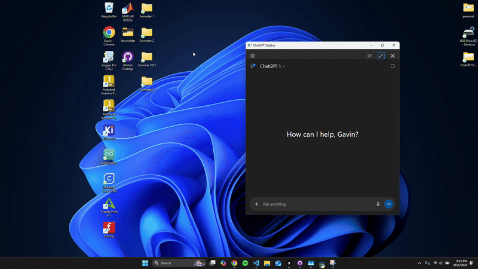

# ChatGPT Sidebar for Windows

ChatGPT Sidebar is a Windows-only desktop utility that integrates the ChatGPT web application into a docked panel on your desktop.  
Unlike a standard floating window, it registers itself with the Windows AppBar API, reserving space on the edge of the screen and behaving like a built-in system panel.  
The goal is to make ChatGPT feel like a native part of the operating system rather than a separate application.

---

## Demonstration

  
*The ChatGPT sidebar docked on the desktop.*

  
*Docking the sidebar to the left and right edges of the screen while desktop icons automatically adjust.*

  
*Running applications in fullscreen mode while the ChatGPT sidebar remains docked.*

  
*Toggling between docked mode and standalone window mode.*

  
*Capturing another application window and inserting the screenshot directly into the ChatGPT conversation.*

## Features

- **Docked Sidebar**  
  Runs as a Windows AppBar, docking to the left or right edge of the screen. Other windows automatically resize around it.

- **Embedded ChatGPT Web App**  
  Displays the ChatGPT web client inside a `QWebEngineView`, avoiding the need for a browser tab.

- **Persistent Configuration**  
  Remembers width, edge (left/right), and docked/undocked state across sessions.

- **Theme Integration**  
  Matches the system light/dark mode for a cohesive appearance.

- **Screenshot-to-Chat**  
  Captures another application window and inserts the screenshot directly into the ChatGPT composer.  
  - Works without writing files to disk.  
  - Does not overwrite the system clipboard.  
  - Blocks insertion while ChatGPT is generating to avoid interruptions.

- **Undock / Redock**  
  Allows the sidebar to toggle between docked mode and a normal floating window. When re-docked, it restores the saved width.

---

## Installation

1. Clone this repository:
   ```bash
   git clone https://github.com/gavinmcutler/chatgpt-sidebar.git
   cd chatgpt-sidebar

---

### Notes
This project was developed by Gavin Cutler with the assistance of AI coding tools (e.g., ChatGPT) for boilerplate generation and iteration. All design decisions, integration logic, and testing were directed and completed by the author.
